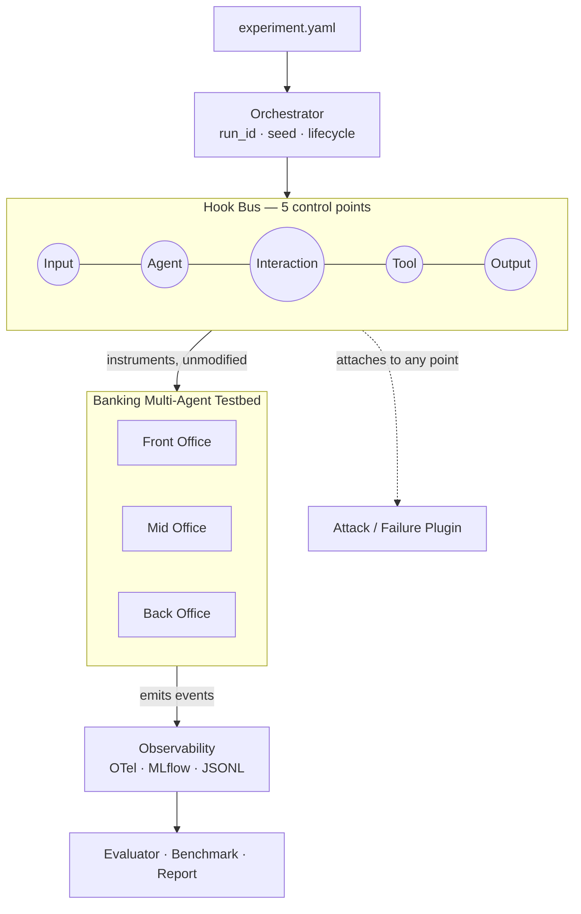

# MANTIS — Modular Agent Network Testbed for Instrumentation and Security

MANTIS is a modular, observable multi-agent security testbed for configuring agents, workflows, tools, attacks, and failures, with end-to-end tracing, evaluation, and reproducible benchmarking.

Currently, MANTIS focuses on banking multi-agent architectures (spanning Front, Mid, and Back-Office workflows) as the primary application domain for security evaluation. The ultimate goal of this platform is to provide a robust **testbed to conduct mock attacks (e.g., prompt injections), capture outputs, and evaluate AI agent failures under adversarial conditions.**

**At a glance:** 3 banking domains &middot; 31 agents &middot; 19+ tools &middot; 5 control points &middot; 4 attack plugins &middot; 3 observability export targets &middot; 0 source edits needed to run an experiment.

---

## Architecture

Every run passes through the same five-point hook bus regardless of domain. An attack or failure plugin declares which point it targets in YAML — the banking agent boxes never change.



## Repository Structure

Following WP1 and WP2, the codebase is modularized and entirely configuration-driven:

```text
MANTIS/
├── README.md
├── MIGRATION.md                       # Details of the legacy-to-MANTIS transition
├── pyproject.toml                     # MANTIS package definition
├── .env.example                       # Copy to .env -- required for live LLM runs
├── src/mantis/                        # Core MANTIS Framework
│   ├── banking/                       # Domain logic (Front/Mid/Back Office)
│   │   ├── agents/, tools/, data/     # Agent defs, banking tool functions, JSON knowledge base
│   │   ├── scenarios/, workflows/     # Scenario prompts; workflow -> domain mapping
│   │   └── domains.py                 # Domain -> agent membership
│   ├── runtime/                       # BankingRuntimeAdapter, ADK<->HookBus glue (WP1)
│   ├── hooks/                         # HookBus, HookContext, HookResult (WP3)
│   ├── config/                        # Pydantic Configuration Models (WP2)
│   ├── core/                          # Generic Registry mechanism, wires banking content in (WP2)
│   ├── cli/                           # CLI entrypoint (`mantis`)
│   ├── observability/                 # WP4: TraceArtifactWriter, MLflow, OpenTelemetry
│   ├── evaluation/                    # WP6: TraceEvaluator
│   ├── benchmark/                     # WP6: BenchmarkRunner
│   └── plugins/                       # attacks/ (WP5), failures/, policies/ (interface only)
├── citi_banking_backend/              # Local Banking API Backend (+ tests/, 13 tests)
├── citi_banking_mcp_server/           # MCP Server for Banking Tools (+ tests/, 3 tests)
├── configs/                           # Experiment Configurations (Baselines, Attacks, Invalid)
├── scripts/                           # Production-ready Validation Scripts
├── docs/                              # Documentation
├── extensions/                        # Custom plugins (e.g. zero_trust/, later/optional)
├── tests/unit/                        # Unit tests (CLI, Registry, HookBus, Plugins, Events) -- 31 tests
├── golden_runs/                       # WP0: Immutable Frozen LLM execution traces
├── banking_baseline_inventory.yaml    # WP0: Full system inventory
├── baseline_metrics.json              # WP0: Performance and behavioral metrics
└── refactor_guard_tests/              # WP0: Regression test suite (49 tests)
```

---

## Current Status: WP1 - WP8 Complete

We have successfully migrated the legacy banking code (**WP1**), replaced hardcoded logic with a declarative YAML engine (**WP2**), implemented the **Hook Bus (WP3)**, established a full **Observability Pipeline (WP4)**, deployed **Attack/Failure Plugins (WP5)**, integrated **Evaluation/Benchmarking (WP6)**, finished the **CLI Campaign Engine (WP7)**, and finalized **Release Validation (WP8)**.

### The Role of WP0 (Regression Guardrails)
**WP0 establishes our invariant baseline.** The 49-test regression suite (`refactor_guard_tests/`) ensures that the core banking business logic and agent behaviors never change or hallucinate. We use these tests constantly to ensure our testbed remains a valid representation of a real-world banking system.

### Getting Started
```bash
# 1. Install prerequisites (Python 3.12+ required)
python -m venv .venv
source .venv/bin/activate
pip install -e .

# 2. Configure model access (only needed for `mantis --run`, not for tests
#    or --validate/--inventory/--generate-schemas/--evaluate)
cp .env.example .env
# edit .env and set UF_NAVIGATOR_API_KEY -- there is no default key baked
# into the code, live runs fail with an auth error until this is set

# 3. Run tests to verify the core systems
pytest tests/unit/

# 4. View available scenarios and commands
mantis --help
```

### The Hook Bus (WP3)
The Hook Bus is the core of MANTIS's adversarial testing capabilities. It provides a non-invasive middleware layer that registers callback functions at five strategic lifecycle events:
1. **Input**: Intercepting raw user prompts before they reach the agent.
2. **Agent**: Monitoring internal reasoning processes.
3. **Interaction**: Modifying communication between the agent and the environment.
4. **Tool**: Intercepting function calls (e.g., to the banking backend) to perform parameter mutation or injection.
5. **Output**: Filtering or auditing the final response provided to the user.

### Project Roadmap

- [x] **WP0**: Freeze and Characterize the Baseline (49 Regression Tests)
- [x] **WP1**: Modularize the Banking Multi-Agent Testbed (NativeBankingAdapter)
- [x] **WP2**: Configuration, Schemas, and Registries (YAML config, schema generation)
- [x] **WP3**: Experiment Control Points and Hook Bus (5 interception points)
- [x] **WP4**: Standard Observability Pipeline (OpenTelemetry, MLflow, JSONL traces)
- [x] **WP5**: Initial Attack and Failure Plugins (Prompt Injection, Message Spoofing, Route Confusion, Tool Mutation)
- [x] **WP6**: Evaluation and Benchmarking (Trace Completeness, Tool Correctness, Overhead plotting)
- [x] **WP7**: CLI and Reproducible User Workflow (Campaign Execution Engine)
- [x] **WP8**: Tests, Documentation, and Research Release

---

## Validating the Platform

We provide production-ready verification scripts in the `scripts/` directory to automatically validate the integrity of the testbed.

1. **WP0 / WP1 Baseline Regression:** 
   ```bash
   ./scripts/verify_baseline_regression.sh
   ```
   *Automatically starts a background backend, traces the LLM front/mid/back office baseline models, asserts semantic behavior matches `baseline_metrics.json`, and shuts down gracefully.*

2. **WP2 Configuration Engine Demo:** 
   ```bash
   ./scripts/verify_wp2_config.sh
   ```
   *Demonstrates the execution of robust YAML experiment generation, configuration hashing, seed reproducibility, and strict validation error propagation.*

3. **WP3 Hook Bus Injection Demo:** 
   ```bash
   ./scripts/demo_wp3_hooks.sh
   ```
   *Highlights the invisible integration of the HookBus by deploying a Mock Attack plugin that intercepts a live ADK tool call, maliciously mutates the `customer_id` parameter, and records coverage stats—without altering core business logic.*

4. **WP4: Observability Pipeline Demo**
   Demonstrates the standardized JSONL traces, OpenTelemetry span extraction, and MLflow exporter via the new `ObservabilityPlugin`.

   ```bash
   ./scripts/verify_wp4_observability.sh
   cat run_artifacts/advanced_attack_test/traces.jsonl | jq
   ```

5. **WP5: Attack and Failure Plugins Demo**
   Execute four distinct security experiments showcasing Prompt Injection, Message Spoofing, Route Confusion, and Tool Parameter Mutation acting on the standard banking workflows.

   ```bash
   ./scripts/demo_wp5_attacks.sh
   ```

6. **WP6: Evaluation and Benchmarking Demo**
   Automatically grade the security artifacts for trace completeness and tool correctness, and run latency benchmarks comparing overhead.

   ```bash
   ./scripts/verify_wp6_evaluation.sh
   ./scripts/demo_wp6_benchmarks.sh
   ```

7. **WP7: Campaign Execution**
   Automatically launch a full folder of YAML configurations, isolate their artifacts, and print a consolidated Markdown evaluation report.

   ```bash
   mantis --campaign configs/attacks/
   mantis --report run_artifacts/campaign_run_<timestamp>
   ```

8. **WP8: Full Release Validation**
   You can verify the complete stability of MANTIS by running the exhaustive master suite:

   ```bash
   ./scripts/release_validation.sh
   ```

---

## 🛡️ Writing Custom Attacks
To write a new attack for MANTIS, implement a plugin class with `name`, `supported_stages`, and `apply(ctx)` and drop it into `src/mantis/plugins/attacks/`. Register it via `plugin_registry.register(...)`. See `src/mantis/plugins/attacks/prompt_injection.py` for a full reference of how prompt injections, route confusions, tool mutations, and spoofing plugins work!

## Running MANTIS for Mock Attacks

If you are a security researcher or developer setting up a mock attack, you drive the MANTIS system entirely via YAML files. Start the backend first, in a separate terminal:

```bash
cd citi_banking_backend
source scripts/run_server.sh
# (Or: python -m uvicorn app.main:app --host 127.0.0.1 --port 8000)
```

Then, from the repo root:

1. **Inspect the real system** — introspected from the live tool modules and agent registry, not a hand-typed list.
   ```bash
   mantis --inventory | jq '.agents | length, .tools | length, .domains | keys'
   # 31
   # 19
   # ["front_office", "mid_office", "back_office"]
   ```

2. **Validate the config before it runs** — domain, workflow, scenario, attack target, and control point are all checked against the real registries, so a typo fails here instead of mid-run.
   ```bash
   mantis --validate configs/attacks/wp5_route_confusion.yaml
   # ✅ Configuration is valid (Experiment: wp5_route_confusion, Scenario: front_office_monitoring)
   ```

3. **Run the clean baseline first**
   ```bash
   mantis --run configs/baselines/front_office_baseline.yaml
   ```

4. **Inject the attack** — same scenario; this plugin forces the front-office router to skip compliance and jump straight to the decision agent.
   ```bash
   mantis --run configs/attacks/wp5_route_confusion.yaml
   ```

5. **Show the interception happened** — machine-readable proof the plugin fired at the declared control point.
   ```bash
   jq '.plugin_stats.tool' run_artifacts/wp5_route_confusion/hook_coverage.json
   ```

6. **Score it automatically** — the evaluator reads the trace and reports the real terminal state.
   ```bash
   mantis --evaluate run_artifacts/wp5_route_confusion
   # "workflow_outcome": { "score": 1.0, "actual_outcome": "manual_review" }
   ```

7. **Sweep every attack config and get one report**
   ```bash
   mantis --campaign configs/attacks/
   mantis --report run_artifacts/campaign_run_<timestamp>
   ```

Every run dumps a `run_manifest.json` into `run_artifacts/<name>/` with the seed and a SHA-256 hash of the config, plus `traces.jsonl` and `hook_coverage.json` alongside it.

---

## Testing

There are four layers of automated tests, plus a fifth layer of live validation scripts. Only the live layer needs a running backend and a real `UF_NAVIGATOR_API_KEY`; everything else runs offline.

| Layer | Location | Count | Command | Needs backend? | Needs LLM key? |
|---|---|---|---|---|---|
| MANTIS unit tests | `tests/unit/` | 31 | `pytest tests/unit/` | No | No |
| WP0 regression guard | `refactor_guard_tests/` | 49 | `pytest refactor_guard_tests/` | No | No |
| Banking backend | `citi_banking_backend/tests/` | 13 | `cd citi_banking_backend && pytest tests/` | No (uses an in-process test DB) | No |
| MCP tool server | `citi_banking_mcp_server/tests/` | 3 | `cd citi_banking_mcp_server && pytest tests/` | No | No |
| Live validation suite | `scripts/release_validation.sh` | WP0-WP7, end-to-end | `./scripts/release_validation.sh` | Yes (auto-started) | **Yes** |

96 tests run offline in a few seconds total; the live suite takes 5-10 minutes because it makes real LLM calls.

### What the 49 WP0 regression tests cover
This suite (`refactor_guard_tests/`) is the invariant baseline: it checks the frozen `golden_runs/` captures, not live LLM output, so it's deterministic and fast. It's deliberately designed to balance **strict structural enforcement** with **flexible semantic parsing** to handle natural LLM non-determinism when golden runs are regenerated.

| Test Class | Tests | What It Validates |
|---|---|---|
| `TestBaselineFilesExist` | 5 | All WP0 deliverable files are present |
| `TestBaselineMetricsStructure` | 12 | Schema correctness: required fields, semantics fields per workflow |
| `TestFrontOfficeTrace` / `MidOffice` / `BackOffice` | 12 | Traces are parseable. Tool/agent matches use resilient logic to gracefully handle valid LLM alternative paths. |
| `TestInventoryConsistency` | 3 | Inventory covers all tools from metrics, all workflows listed |
| `TestFrontOfficeBehavior` / `MidOffice` / `BackOffice` | 17 | **Advanced:** Agent execution order, routing paths, tool usage, and business outcomes. *Evaluated flexibly to avoid false alarms.* |

### What the live validation suite covers
`scripts/release_validation.sh` runs the full WP0-WP7 pipeline against a live backend and real LLM calls: baseline regression, config validation, hook bus injection (checks `hook_coverage.json` has nonzero hits on all 10 hook points), observability trace generation, all 4 attack plugins, evaluation scoring, an observability-overhead benchmark, and a full campaign run with report generation. It's the ground truth for "does this actually work end to end," as opposed to the offline suites, which check components in isolation.

---

## Environment Information

### Source Repository:
- **Citi_P3 (Legacy Source):** https://github.com/smartsystemslab-uf/Citi_P3

### Environment:
- **Python:** 3.12.7
- **LLM:** UF Navigator API (`https://api.ai.it.ufl.edu`), model `gpt-oss-20b`
- **Backend:** FastAPI + SQLite (`citi_banking_backend`)
- **Agent framework:** Google ADK with LiteLLM adapter (`src/mantis/runtime`)
- **Tool server:** FastMCP (stdio transport, `citi_banking_mcp_server`)

---

## Developer Guidelines
1. **Unit Testing:** Ensure 100% unit test coverage for new scripts. It's REQUIRED to post unit test code here.
2. **Integration Testing:** Every `.py` or executable file must have corresponding integration tests included. All integration tests must pass before submission.
3. **AI Assistance:** The use of AI tools is encouraged. Please use whichever tools work best for your workflow.
4. **Commits:** Include a brief description of what was changed and why the change was necessary when pushing.
